<div align="center">

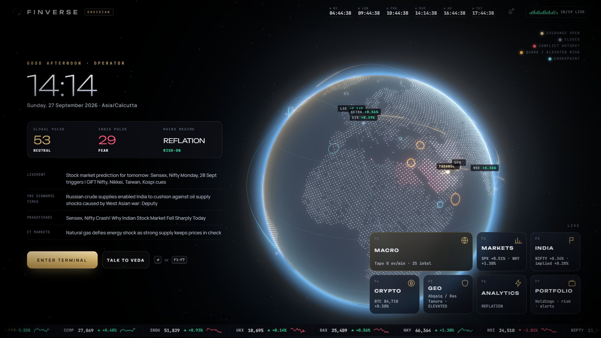

# FINVERSE · Macro Intelligence Terminal

**A Bloomberg-style macro terminal built entirely on free, keyless public data — with a cinematic 3D interface
and a voice analyst you wake by saying her name.**


[Highlights](#highlights) · [Screenshots](#screenshots) · [Quick start](#quick-start) · [VEDA](#veda--voice-of-finverse) ·
[Workspaces](#workspaces) · [Architecture](#architecture) · [Data sources](#data-sources) · [Configuration](#configuration)

</div>

---

## Highlights

- **One command, no keys.** `python run.py` starts a supervised engine of ~20 live feeds and opens the terminal. No database server, no API keys, no build step.
- **Cinematic 3D interface.** Particle intro, a live 3D globe home with a real day/night terminator, and a 3D *Macro Terrain* map where every country rises by the metric you choose.
- **VEDA, the voice of Finverse.** Say *"Veda, what's the situation in the Gulf?"* — a human form assembles from neon dust and answers out loud in a natural neural voice, lip-synced to her speech.
- **India-first analytics.** A transmission model that turns last night's global moves into an *implied open* for every Indian sector, plus a what-if simulator.
- **Evidence over opinion.** An event-study lab with 15 years of data and bootstrap confidence intervals, a macro regime compass, fear/greed pulses and correlation-break detection.
- **Honest by design.** Every panel shows its source, delayed data is labelled, and nothing is simulated. When a source is down, the terminal says so.

## Screenshots

| | |
|:--:|:--:|
| 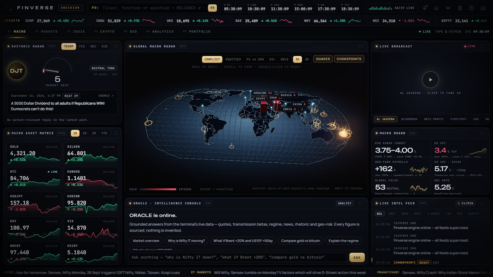 | 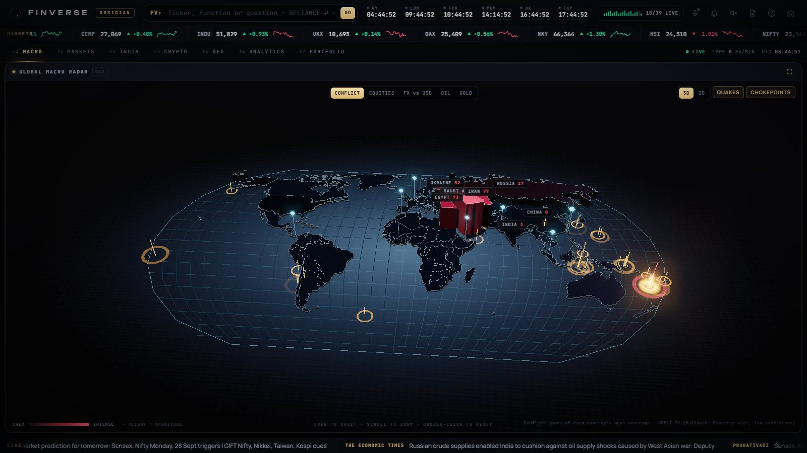 |
| **MACRO** — rhetoric radar, asset matrix, 3D radar, Oracle, broadcast, macro board, live intel | **Macro Terrain** — country height & colour = conflict / equities / FX / oil / gold |
| 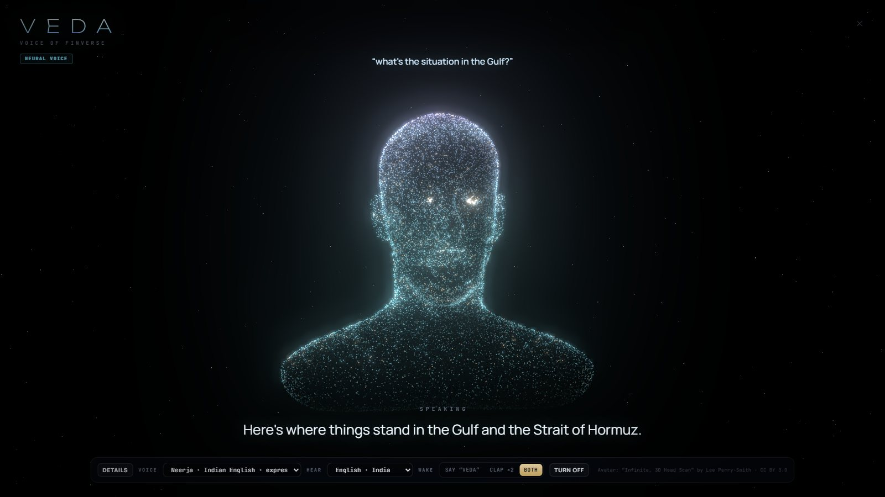 | 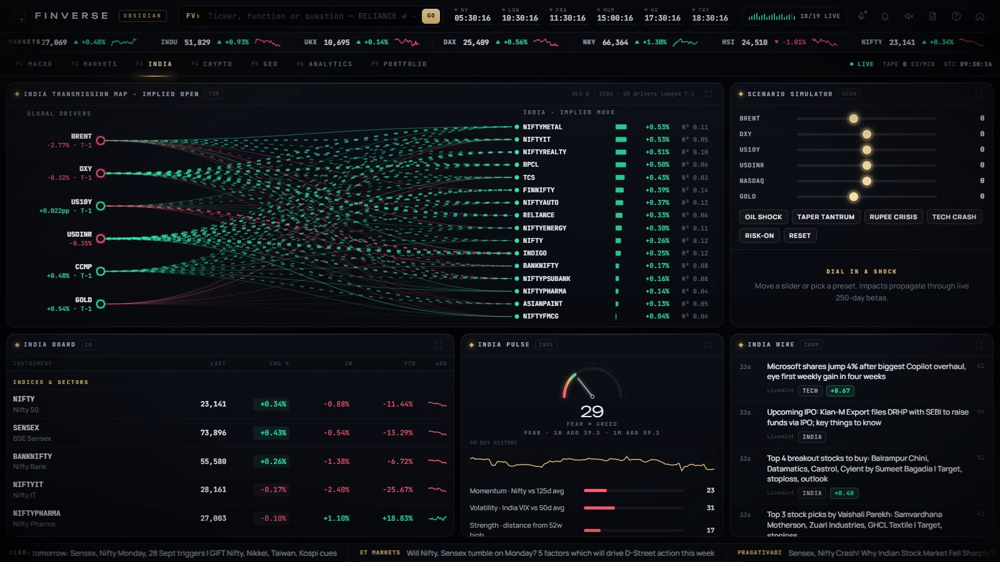 |
| **VEDA** — wake by name or a double clap; spoken answers with lip-sync | **INDIA** — transmission map, implied open, scenario simulator, India pulse |
| 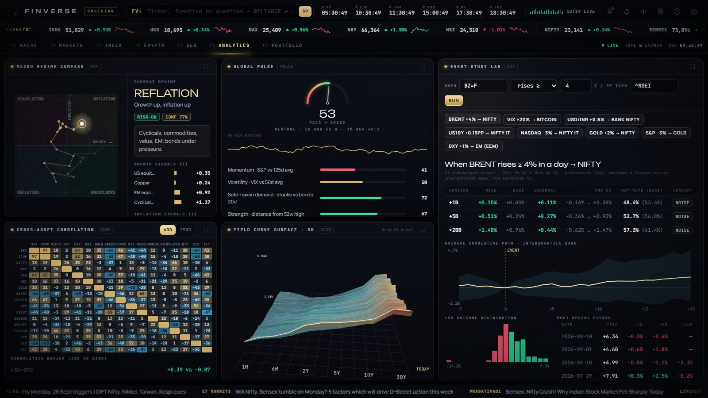 | 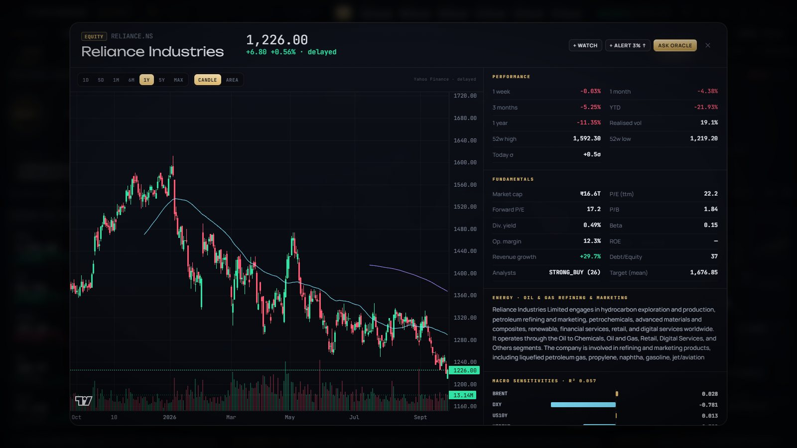 |
| **ANALYTICS** — regime compass, pulse, event-study lab, correlation, 3D yield surface | **Security page** — candles, fundamentals, macro betas, options analytics |
| 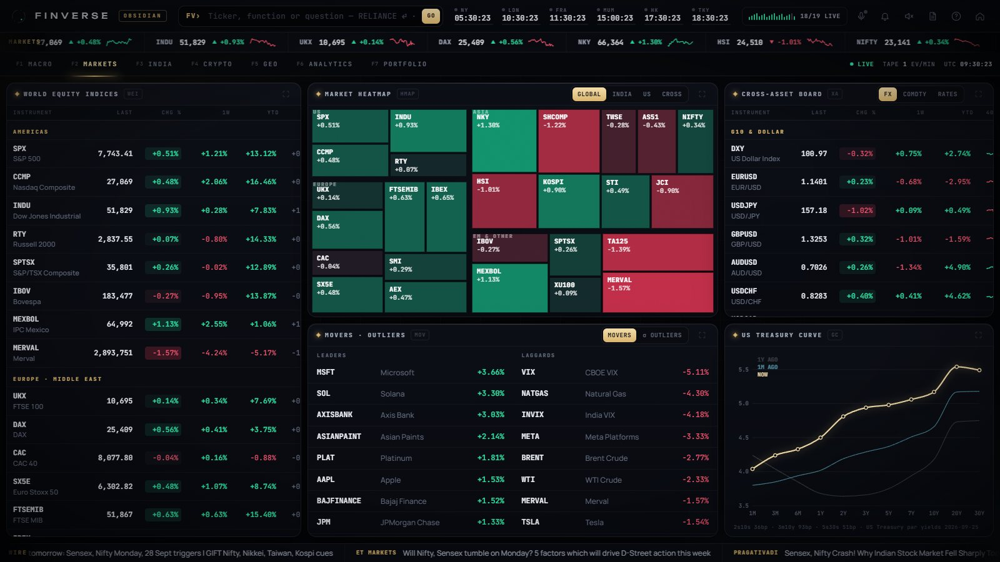 | 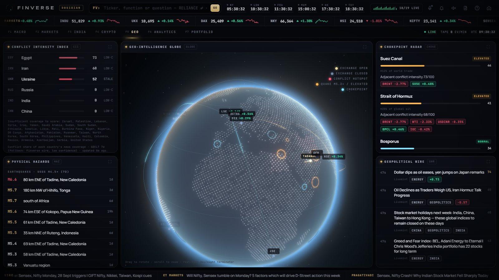 |
| **MARKETS** — world indices, heatmap, cross-asset board, Treasury curve | **GEO** — 3D globe, conflict index, chokepoint radar, hazards |

<details>
<summary><b>Cinematic intro</b></summary>
<br />
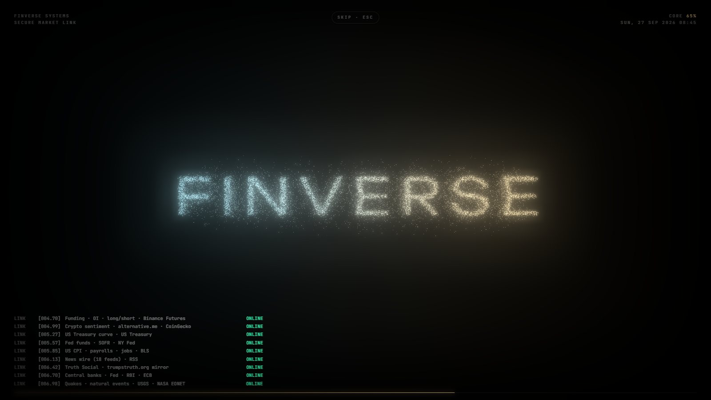
</details>

## Quick start

**Requirements:** Python 3.11+, Chrome or Edge (for voice), and an internet connection for the public data feeds.

```bash
git clone https://github.com/kanikakataria75-ship-it/finverse-macro-terminal.git
cd finverse-macro-terminal
pip install -r requirements.txt
python run.py
```

The terminal opens at **http://127.0.0.1:8777**. On Windows you can simply double-click **`Finverse.bat`**.

1. Click **Initialize** (or press Enter) and allow the microphone when asked, so VEDA can listen.
2. Watch the intro (or tick *Skip cinematic next time*), then press **Enter** on the home screen.
3. Type a ticker into the command line (`RELIANCE`, `AAPL`, `BTC`), or just say **"Veda, how are markets today?"**

> The first start downloads two years of history for ~140 instruments (about 10 seconds). Later starts use the local cache.

## VEDA · voice of Finverse

*Veda* (Sanskrit वेद, "knowledge") is the terminal's voice analyst.

| | |
|---|---|
| **Wake her** | Say **"Veda…"** — you can ask in the same breath: *"Veda, how's the rupee doing?"* — or clap twice, press **V**, or click the mic. She starts listening when Finverse turns on (toggle on the power-on screen). |
| **Ask** | Any market or company (*"how is Tata Motors doing?"*); regions (*Gulf, Middle East, Red Sea, Russia–Ukraine, Taiwan, India–Pakistan*); the Fed, RBI and ECB; inflation, jobs and bonds; today's news; what's coming up; market mood; crypto; comparisons (*"gold versus bitcoin"*); and what-ifs (*"what if the rupee falls 5 percent and yields jump 50 bp"*). Say *"Veda, stop"* to interrupt. |
| **Voice** | Free Microsoft neural voices, default **Neerja · Indian English**, with eight alternatives (Indian, American, British, Hindi). Phrases are cached, so repeats are instant; browser voices are the fallback. |
| **Form** | ~26,000 particles sampled from a 3D head scan, with hologram lighting, a jaw driven by the real audio amplitude, a data halo while thinking, and a dissolve back to dust. |
| **Privacy** | Clap detection runs on-device. The wake word and questions use the browser's speech recogniser (Chrome → Google, Edge → Microsoft) while VEDA is on. A *"VEDA heard …"* note shows what she picked up. |

## Workspaces

| Key | Workspace | What's inside |
|---|---|---|
| `F1` | **MACRO** | Rhetoric Radar (Truth Social + Fed/RBI/ECB hawk–dove), Macro Asset Matrix, **3D Macro Terrain**, Oracle console, live broadcast, Macro Board (Fed, CPI, payrolls, 10Y, pulse, RBI), live intel feed |
| `F2` | **MARKETS** | World Equity Indices, live treemap heatmap, FX / commodities / rates board, movers & σ-outliers, Treasury curve |
| `F3` | **INDIA** | Transmission map & implied open, scenario simulator, India board, India Pulse, India wire |
| `F4` | **CRYPTO** | Live Binance board, multi-venue liquidation waterfall (OKX · Bybit · Binance), funding / OI / long-short, liquidation tape, crypto Fear & Greed |
| `F5` | **GEO** | 3D geo-intelligence globe, Conflict Intensity Index, Chokepoint Radar, earthquakes & natural hazards, geopolitical wire |
| `F6` | **ANALYTICS** | Macro Regime Compass, Global Pulse, Event Study Lab, correlation matrix with break detection, 3D yield-curve surface |
| `F7` | **PORTFOLIO** | Holdings with live ₹ P&L, risk engine (VaR, CVaR, beta, drawdown, stress tests), alerts, watchlist, Daily Brief |

Any panel maximizes with **⤢** or a double-click on its title; **Esc** restores it.

### Analytics engines

| Engine | What it does |
|---|---|
| **India Transmission Model** | Multivariate betas of Indian sectors on Brent, DXY, US10Y, USD/INR, Nasdaq and gold (US-settled drivers lagged a session) → implied open, actual move and stock-specific residual |
| **Scenario Simulator** | Shock any driver and propagate it through live betas to sectors and your portfolio |
| **Event Study Lab** | "When X moved like this, what did Y do next?" — declustered events, abnormal returns, 95% bootstrap CIs, hit rates |
| **Regime Compass** | Growth × inflation from cross-asset momentum z-scores, with a 120-day trail and risk appetite |
| **Pulse** | Fear/greed composites for Global and India from real components (momentum, volatility, safe-haven and junk-bond demand, breadth, rupee) |
| **Chokepoint Radar** | Hormuz, Bab-el-Mandeb, Suez, Malacca, Taiwan Strait, key fabs and refineries: hazards plus adjacent conflict, with the exposed assets |
| **Conflict Intensity Index** | The *share* of each country's news coverage about armed conflict (GDELT), so heavily covered countries aren't painted as war zones |
| **Oracle** | Grounded Q&A over live data — explain, compare, scenarios, regions, macro topics, calendar — with an optional local LLM via Ollama |
| **Alerts** | `BTC > 120000` · `NIFTY PCT < -1.5` · `Z 3` · `NEWS hormuz` · `LIQ 2M` · `HEAT 70` → feed, toast, browser notification, Telegram |

## Architecture

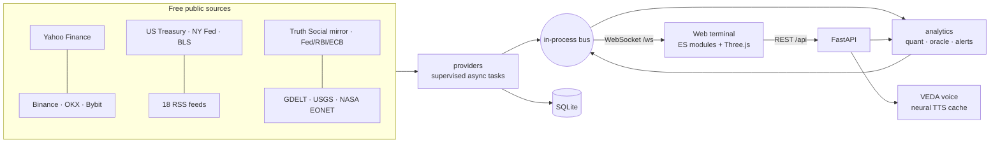

```
run.py                   one command: engine + UI
finverse/
  api.py                 REST + WebSocket gateway, static UI
  engine.py              supervisor: self-healing feeds with live health
  bus.py · store.py      in-process pub/sub · SQLite (WAL)
  universe.py            instrument master (symbology, classes, countries)
  voice.py               VEDA's neural text-to-speech with disk cache
  providers/             markets · crypto · macro · news · rhetoric · geo · angel
  analytics/             quant · oracle · topics · regions · speech · alerts · nlp
web/
  index.html · css/      Obsidian design system
  js/core/               state · util · sound · world · voice (VEDA)
  js/three/              intro · globe · map3d · surface · avatar
  js/panels/ · js/views/ workspaces, terminal shell, overlays
  vendor/                three · d3 · topojson · lightweight-charts · world-atlas (served locally)
research/                Truth Social × markets event study
tools/                   research rebuild scripts
```

See [SYSTEM_MAP.md](SYSTEM_MAP.md) for the detailed data flow and [CHANGELOG.md](CHANGELOG.md) for release notes.

## Data sources

All free. Every panel labels its source; delayed data is marked *delayed* and estimated dates *est.*

| Domain | Source | Cadence |
|---|---|---|
| ~140 instruments across 9 asset classes | Yahoo Finance (delayed) | 60 s quotes · 2-year history cache |
| Crypto spot | Binance WebSocket (real-time) | stream |
| Liquidations | OKX + Bybit + Binance public WebSockets | stream |
| Funding, open interest, long/short | Binance futures REST | 60 s |
| Crypto sentiment & dominance | alternative.me · CoinGecko | 15 min |
| US yield curve | US Treasury | 3 h |
| Fed funds, EFFR, SOFR | New York Fed | 3 h |
| CPI, core CPI, payrolls, unemployment, wages | BLS | 12 h |
| News | 18 RSS feeds (ET, Mint, Business Standard, BusinessLine, CNBC, MarketWatch, BBC, Al Jazeera, CoinDesk, Google News…) | 90 s |
| Rhetoric | Truth Social public mirror · Fed / RBI / ECB press releases | 90 s / 10 min |
| Conflict | GDELT DOC 2.0 (fallback: Finverse wire) | 6 h |
| Hazards | USGS earthquakes · NASA EONET | 15 min |
| NSE real-time *(optional)* | Your Angel One SmartAPI account | stream |

## Configuration

Everything is optional — copy `.env.example` to `.env` only for what you use.

| Variable | Purpose | Default |
|---|---|---|
| `FINVERSE_HOST`, `FINVERSE_PORT` | Bind address | `127.0.0.1`, `8777` |
| `ANGEL_ENABLED`, `API_KEY`, `CLIENT_ID`, `MPIN`, `TOTP_SECRET` | Angel One real-time NSE ticks (a failed login is never retried) | off |
| `TELEGRAM_BOT_TOKEN`, `TELEGRAM_CHAT_ID` | Push fired alerts to Telegram | — |
| `OLLAMA_URL`, `OLLAMA_MODEL` | Free local LLM to polish Oracle answers | `llama3.2` |
| `VEDA_VOICE` | Default neural voice | `en-IN-NeerjaExpressiveNeural` |
| `QUOTE_INTERVAL`, `LIQ_FEED_MIN_USD`, `SIGMA_ALERT` | Tuning | `60`, `250000`, `2.5` |

## Command line

| Command | Does |
|---|---|
| `RELIANCE` ⏎ · `AAPL` · `BTC` · `ZOMATO.NS` | Security page (any Yahoo symbol) |
| `ASK why is Nifty IT down?` — or any question ending in `?` | Oracle |
| `WEI` `HMAP` `GC` · `TX` `SCEN` · `LIQ` `FUND` · `GEO` `CHOKE` · `RGM` `CORR` `EVT` `GC3D` · `PORT` | Jump to a function |
| `ALRT BTC > 120000` · `WATCH TSLA` · `N hormuz` · `BRIEF` · `HEALTH` · `VEDA` · `HOME` · `MUTE` · `HELP` | Actions |
| `F1`–`F7` · `/` or `Ctrl K` · `V` · `Esc` · `?` | Keyboard |

URL flags: `?intro=0` skips the cinematic · `?to=terminal` opens straight into the terminal.

## Known limitations

- Yahoo Finance quotes are delayed (~15 min for most exchanges). Futures moves are measured on the front contract and the analytics history is back-adjusted at every roll Finverse observes, but rolls from before its first run remain in the 2-year history as small steps.
- GDELT rate-limits aggressively; the conflict index then falls back to the Finverse wire and is marked low-confidence.
- Some networks receive no Binance futures stream data; OKX and Bybit keep the liquidation tape alive.
- Market sessions model regular hours only (exchange holidays are not yet modelled).
- Voice recognition requires Chrome or Edge and an internet connection.

## Roadmap

- NSE option chain and OI analytics via Angel One
- FII/DII daily flows
- Offline speech recognition (local Whisper) for a fully private wake word
- Desktop shell with pop-out panels for multi-monitor setups
- Exchange holiday calendars

## Credits

- 3D head scan: *"Infinite, 3D Head Scan"* by Lee Perry-Smith, licensed [CC BY 3.0](https://creativecommons.org/licenses/by/3.0/) (via the three.js examples).
- Libraries: [three.js](https://threejs.org) (MIT), [D3](https://d3js.org) & topojson-client (ISC), [Lightweight Charts™](https://www.tradingview.com/lightweight-charts/) by TradingView (Apache-2.0), [world-atlas](https://github.com/topojson/world-atlas) (ISC), FastAPI, yfinance, edge-tts.
- Neural voices are served by Microsoft's Edge Read Aloud service through the open-source `edge-tts` client — fine for personal use; review Microsoft's terms before any commercial deployment.
- Market, macro and news data belong to their respective providers and are used under their public terms.

## Disclaimer

Finverse is an analytics and research tool. Nothing in it is investment advice or a recommendation to buy or sell any security.
